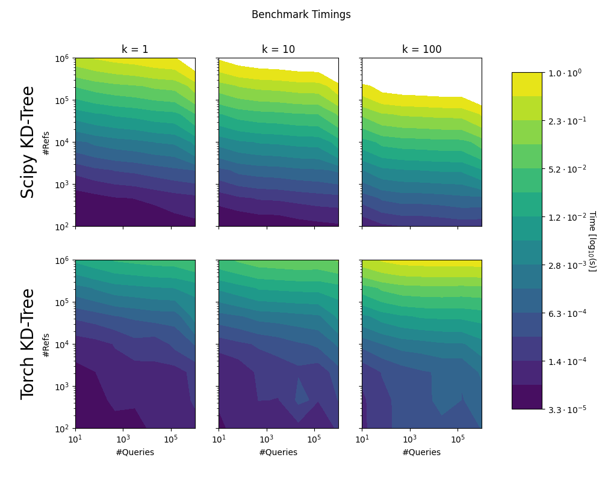

# CUDA/Tensorflow KD-Tree K-Nearest Neighbor Operator
This repository implements a KD-Tree on CUDA with an interface for [cupy](https://cupy.dev/). It is a port of a previous implementation for tensorflow called [tf_kdtree](https://github.com/thomgrand/tf_kdtree).

The KD-Tree is always generated using the CPU, but is automatically transferred to the GPU for cupy operations there. The KD-Tree implementation will search the k nearest neighbors of each queried point in logarithmic time and is best suited for repeated nearest neighbor queries in a static point cloud.

The algorithms' dimensions are currently defined through template parameters and must be known at compile-time. The present version compiles the library for the dimensionalities 1, 2, 3. See [Compiling additional dimensions](#compiling-additional-dimensions) for instructions on how to compile additional dimensions.

# Usage Examples

```python
from cp_kdtree import build_kd_tree
import cupy as cp
from scipy.spatial import KDTree #Reference implementation
import numpy as np

#Dimensionality of the points and KD-Tree
d = 3

#Create some random point clouds
points_ref = np.random.uniform(size=(1000, d)).astype(np.float32) * 1e3
points_query = cp.random.uniform(size=(100, d)).astype(cp.float32) * 1e3

#Create the KD-Tree on the GPU and the reference implementation
cp_kdtree = build_kd_tree(points_ref, device='gpu')
kdtree = KDTree(points_ref)

#Search for the 5 nearest neighbors of each point in points_query
k = 5
dists, inds = cp_kdtree.query(points_query, nr_nns_searches=k)
dists_ref, inds_ref = kdtree.query(points_query.get(), k=k)

#Test for correctness 
#Note that the cupy_kdtree distances are squared
assert(np.all(inds.get() == inds_ref))
assert(np.allclose(cp.sqrt(dists).get(), dists_ref, atol=1e-5))
```

# Installation

Prerequisites
-------------
- Numpy (installed with `setuptools`)
- Cupy (installed with `setuptools`)
- Cuda
- g++, or Visual Studio (MacOSX is untested)
- CMake

Build Instruction
-----------------
The easiest way of installing the library is using `setuptools`:
```bash
pip install .
```


# Tests
After installation, you can run `python -m pytest tests` to verify that the library has been installed correctly.

# Benchmark

We compared the implementation to scipy.spatial.KDTree. Note that the benchmarks do not consider the time to build the KD-Trees, or the transfer to the GPU. Times greater than 1 second not shown.

Test Machine Specs: AMD Ryzen Threadripper 3970X 32x 3.7GHz, 128GB of working memory and a NVidia RTX 3090 GPU.



To run the benchmark on your computer, simply run `python benchmark/benchmark.py`. This will create `benchmark_results.npz` that can be converted to a figure using `python benchmark/plot_benchmark.py` (will require `matplotlib`).

# Compiling additional dimensions

The dimension of the KD-Tree are compile time dynamic, meaning that the dimensions to be queried need to be known at compile time. By default, the library is compiled for d in [1, 2, 3]. You can add additional dimensions by adding new template dimensions to the pybind11 module in `interface.cpp` (line 115).

To add dimensionality 8 for example, you can add:
```cpp
    KDTREE_INSTANTIATION(float, 8, false, "KDTreeCPU8DF");
    KDTREE_INSTANTIATION(double, 8, false, "KDTreeCPU8D");
    KDTREE_INSTANTIATION(float, 8, true, "KDTreeGPU8DF");
    KDTREE_INSTANTIATION(double, 8, true, "KDTreeGPU8D");
```

This will instantiate the template functions for float and double types both on the CPU and GPU.

# Limitations

- Int32 KNN indexing inside the library
- Data must be cast to contiguous arrays before processing (automatically done by the library)
- No in-place updates of the KD-Tree. If you modify the point-cloud, you will have to create a new KD-Tree.


# Acknowledgements

If this works helps you in your research, please consider acknowledging the github repository, or citing our [paper](https://arxiv.org/abs/2102.09962) from which the library originated.

```bibtex
@article{grandits_geasi_2021,
	title = {{GEASI}: {Geodesic}-based earliest activation sites identification in cardiac models},
	volume = {37},
	issn = {2040-7947},
	shorttitle = {{GEASI}},
	url = {https://onlinelibrary.wiley.com/doi/abs/10.1002/cnm.3505},
	doi = {10.1002/cnm.3505},
	language = {en},
	number = {8},
	urldate = {2021-08-12},
	journal = {International Journal for Numerical Methods in Biomedical Engineering},
	author = {Grandits, Thomas and Effland, Alexander and Pock, Thomas and Krause, Rolf and Plank, Gernot and Pezzuto, Simone},
	year = {2021},
	keywords = {eikonal equation, cardiac model personalization, earliest activation sites, Hamilton–Jacobi formulation, inverse ECG problem, topological gradient},
	pages = {e3505}
}
```

